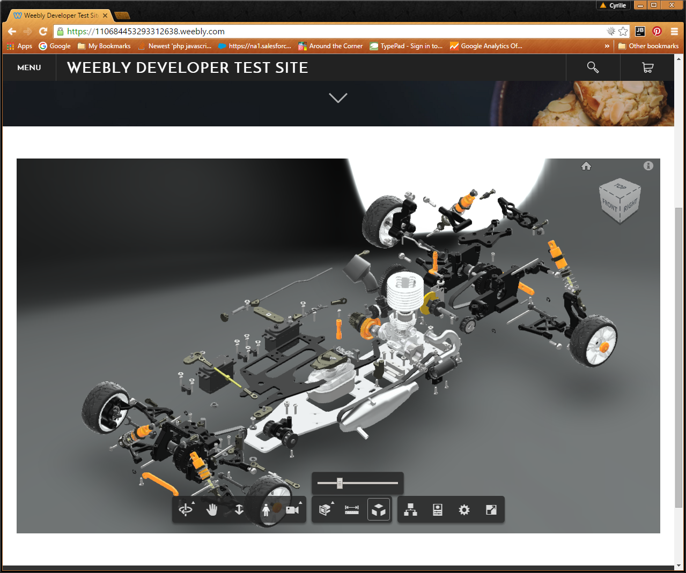

# Autodesk Viewer Weebly widget

Demonstrates the Autodesk View and Data API in the weebly framework.

## Description

The live demo requires an oAuth Access Token which expires every 30 minutes. Because weebly is on hhtps, and I do not have a
certificate for the backend site, I need to update the token manually but the code is ready to go. Here is a screenshot to
show what you can expect. If you want to see the viewer in action, go [here](http://viewer.autodesk.io/node/gallery/#/viewer?id=551d0768be86fc2c1138b4d4).

[Weebly live demo](https://110684453293312638.weebly.com/)

Nothing is better than a visual, so here is a screenshot of a realtime exploded engine.

## License

This application/widget is licensed under the terms of the [MIT License](http://opensource.org/licenses/MIT). Please see the [LICENSE](LICENSE) file for full details.

## Written by

Cyrille Fauvel, Autodesk Inc.  
Autodesk Developer Network  
http://www.autodesk.com/adn  
http://around-the-corner.typepad.com  
